计算机网络：以相互**共享资源**的方式**互联**起来的**自治**计算机系统的集合；最重要的特征是**通用性**

 

 

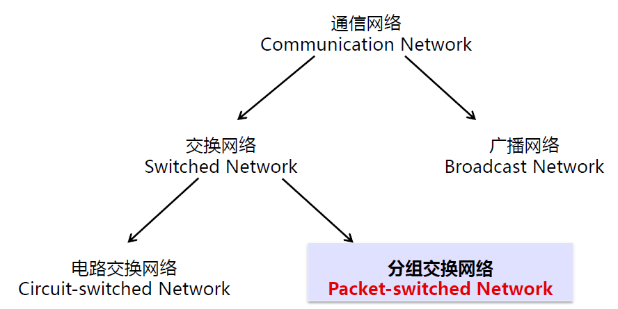

 

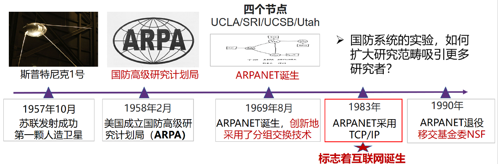

 

APRANET采用TCP/IP标志着**互联网的诞生**

 

个人区域网(PAN)主要是用无线通信技术实现联网设备之间的通信；

局域网(LAN)按照技术、应用范围与协议标准不同可分为**共享局域网**与**交换局域网**，决定性能的三个因素：拓扑、传输介质、介质访问控制方法；

城域网(MAN)以IP协议为基础三网融合，**完善的光纤传输网**是基础，**高端路由器和多层交换机**是核心设备，扩大带宽接入规模与服务质量是应用的关键；

广域网(WAN) 国际性，是因特网的核心部分，研究重点是**宽带核心交换技术**

 

服务提供商(ISP) 用户接入和使用各种网络服务都要经过ISP（tier-1 ISP->regional ISP->更底层）

互联网交换点(IXP) 不同电信运营商之间**为连通各自网络**而建立的集中交换平台

 

传播时延：信道距离m / 信号的传播速率m/s

发送时延：数据包大小bit / 发送速率（带宽）bps

处理时延： 交换结点为存储转发处理花费的时间

排队时延：交换结点缓存队列中分组排队所经历的时延

时延带宽积 = 传播时延x带宽 以bit为单位的链路长度，等效于第一个bit到达接收方时发送方可以发送的bit数

存储为1024进制，速率是1000进制（1K = 1000），但是硬盘的存储是1000进制的

 

计算机网络设计需求：1、可拓展的连通性 2、高性价比的资源共享 3、支持通用服务

 

**协议**：两个或多个网络对等实体之间通信所需遵从的特定规则，向高层实体提供通信服务；协议三要素：语法、语义、同步

计算机网络的体系结构是计算机网络**各层及其协议**的集合、模块化设计

**实体**是构成网络系统各层次的抽象对象，**协议**是控制两个对等实体进行通信的规则集合，协议是“水平的”，**服务**是“垂直的”。在协议控制下，两个对等实体的通信使得本层能够向上一层提供服务，要实现本层协议，需要使用下层所提供的服务

 

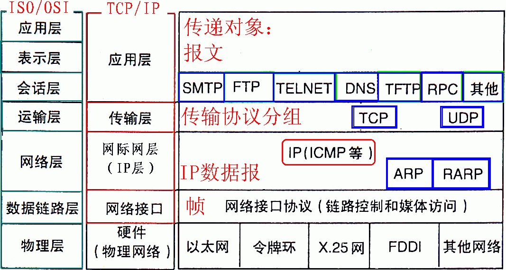

OSI是网络互联的**参考概念模型**

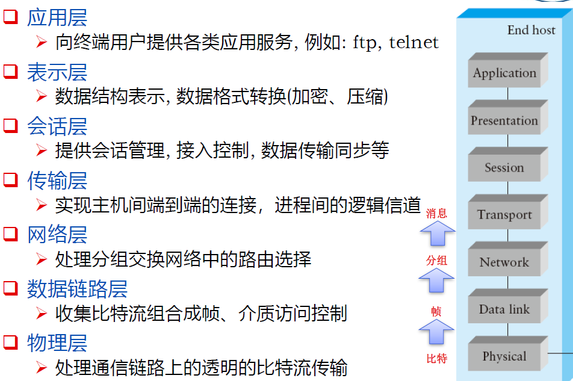

1.物理层：完成相邻两个节点间比特流的传输。
2.数据链路层：**点到点**，完成数据链路间的帧的正确传输。为此要完成**链路管理、差错控制、流量控制**等等功能。 物理地址寻址、数据的成帧、流量控制、数据的检错、重发
3.网络层：要完成**路由选择、差错控制、拥塞控制**等功能。
4.传输层：完成**端到端**的消息的正确传输。为此要完成**分组的排序、流量控制、差错控制**等等功能。
5.会话层：完成会话的进程控制，插入同步点。
6.表示层：完成消息的加密、解密；压缩、解压缩；不同系统间格式的转换。
7.应用层：系统与用户间的接口。

一层（物理层）：网卡（物理层和MAC子层）、集线器、中继器
二层（数据链路层）：网桥、交换机
三层（网络层）：路由器、网关																						应用层、表示层、会话层、传输层：网关

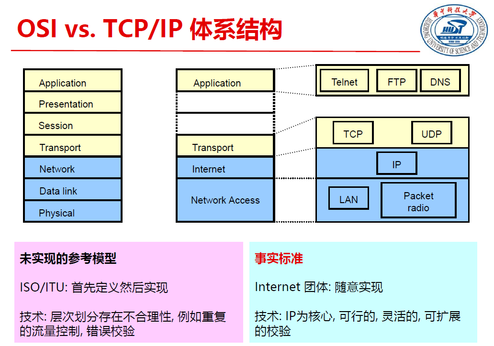

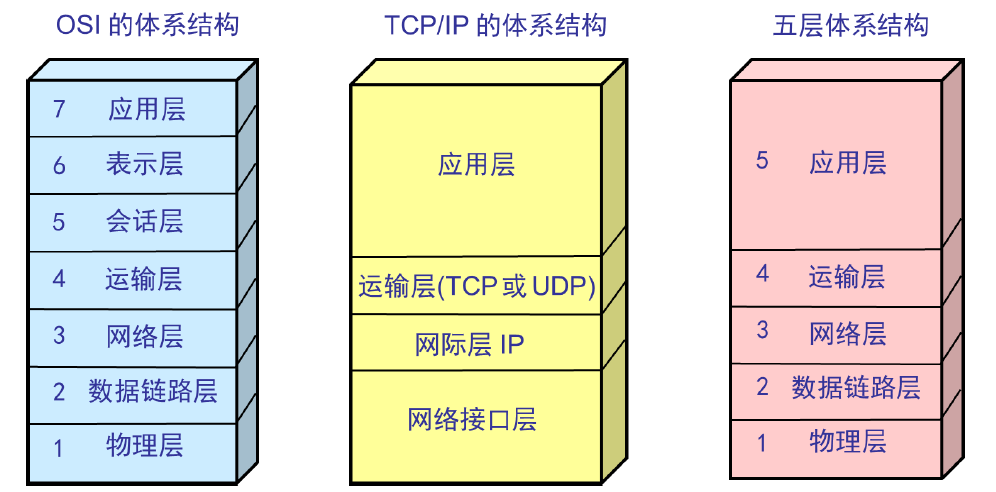

**中继器**的作用是根据输入端的信号重新生成原始信号再通过输出端传送出去，中继器仅适用于以太网，可将两段或两段以上以太网（还是指同一个以太网）互连起来
**集线器**（星型拓扑结构）是中继器的一种形式（多端口中继器），都工作在物理层
数据链路层的数据封装与解封是由**网卡（网络适配器）**完成的
构成网络系统的各个层次的抽象对象称作**实体**
提供可靠的端到端服务的是**传输层**
**数据链路层**为网络层提供**差错控制**和**流量控制服务**
**网关**：网间连接器、协议转换器，连接不同的网络
**路由器**：工作在网络层，是网关的一种实现
**网桥**（以太网交换机）像一个聪明的中继器，可以拓展局域网，工作在数据链路层，转发表
**交换机**就是多端口网桥，都工作在第二层（数据链路层）

 

 

物理层研究问题：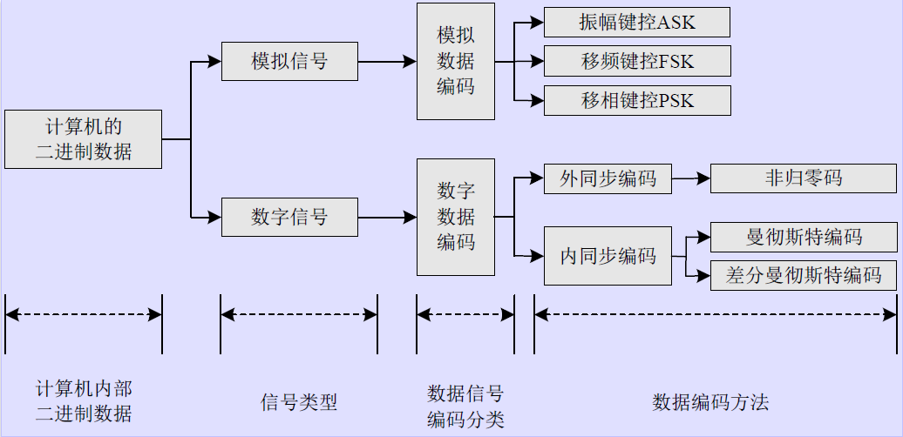

数据链路层研究问题：**帧定界（组帧）**、**差错检测**、**可靠传输**

数据链路层中，上面的**LLC（Logic Link Control）子层**实现数据链路层与硬件无关的功能，比如**流量控制、差错恢复**等；较低的**MAC（Media Access Control）子层**提供LLC和物理层之间的接口，MAC子层分配单独的局域网地址，就是通常所说的MAC地址（物理地址），MAC子层负责把物理层的“0”、“1”比特流组建成帧，并通过帧尾部的错误校验信息进行错误校验；提供对共享介质的访问方法，包括以太网的带冲突检测的载波侦听多路访问（CSMA/CD）

网络适配器（网卡）功能：串并转换、数据缓存、设备驱动程序

接口特性：机械特性、电气特性、功能特性、规程特性

 

### 数据链路层

#### 帧定界

**字节计数法**：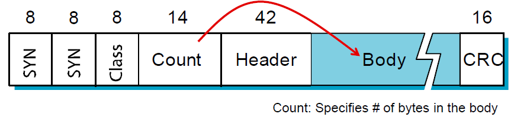

**起止标记法**：

1、**BISYNC**：STX(0x02),ETX(0x03),数据部分字符填充DLE(0x10)转义

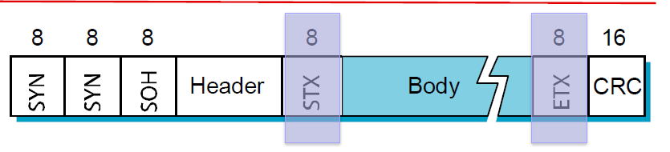

2、**PPP**：Flag(0x7E)，链路控制（LCP）、网络控制（NCP）

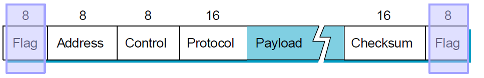

 

**面向比特的协议**：**HDLC**  起止比特位串（01111110）**发送端**每发5个1插1个0，**接收端**每收到5个1，后续为0删除0，为10帧结束，为11出错

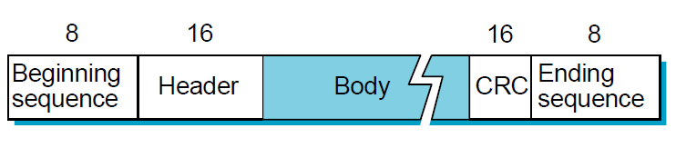

#### 差错检测

1、二维奇偶校验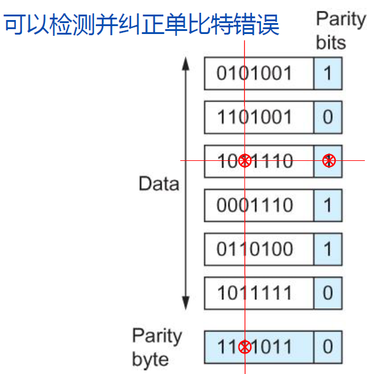

2、循环冗余校验（**CRC**）（在网卡实现）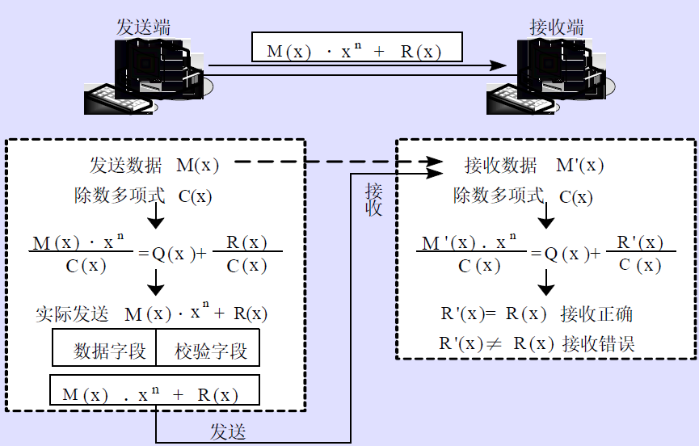

#### 可靠传输

确认ACK、定时器超时、帧序号

1、**自动请求重传（ARQ）**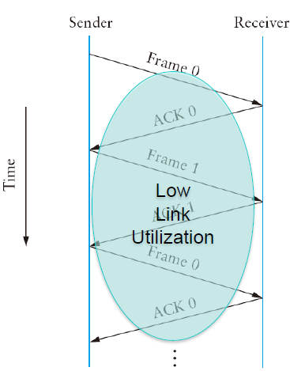

2、**连续ARQ**

- **Go-Back-N**(错误帧后面的都要重传，接收方不需要缓存)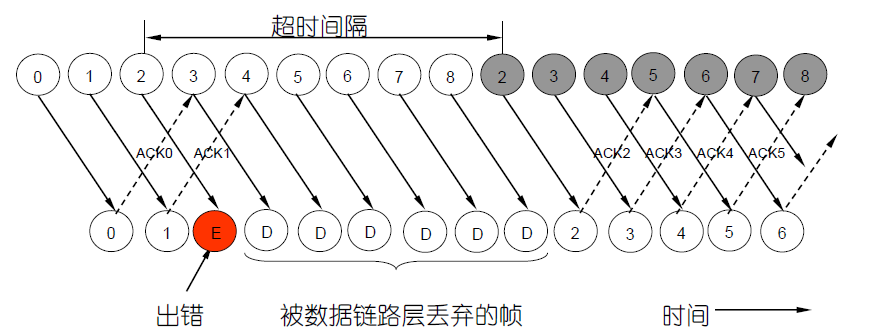
- **选择重传**（仅重传错误帧，接收方需要缓存）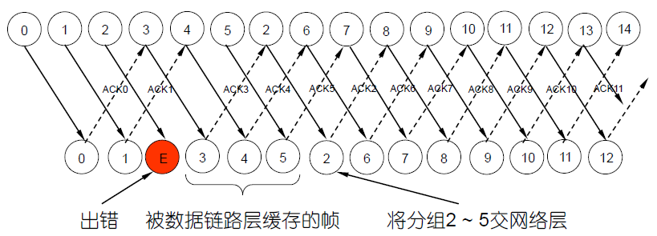

3、滑动窗口协议

发送窗口+接收窗口 ≤ 2^w  (w:帧序号的比特数量)

又分Go-Back-N和选择重传

 

### 介质访问控制子层

#### 多路访问

寻址

干扰：多个节点同时传输；冲突：节点同时收到多个信号

- 静态信道划分：TDMA(时分多路复用)、CDMA(码分多址)、FDMA(频分多路复用)
- 随机接入：
  
  Aloha（纯Aloha、时隙Aloha）
  
  载波监听多路访问CSMA：监听信道，空闲时发送，但由于传播时延仍有冲突

- 轮转接入：中央受控轮询（主节点邀请从节点轮流发送）、令牌传递
  
  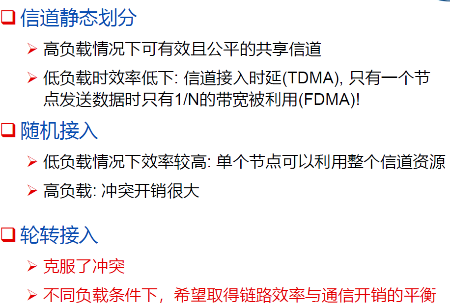

 

### 以太网

10Mbps、基带传输->10BASE

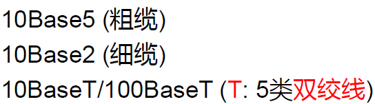

 

#### MAC协议

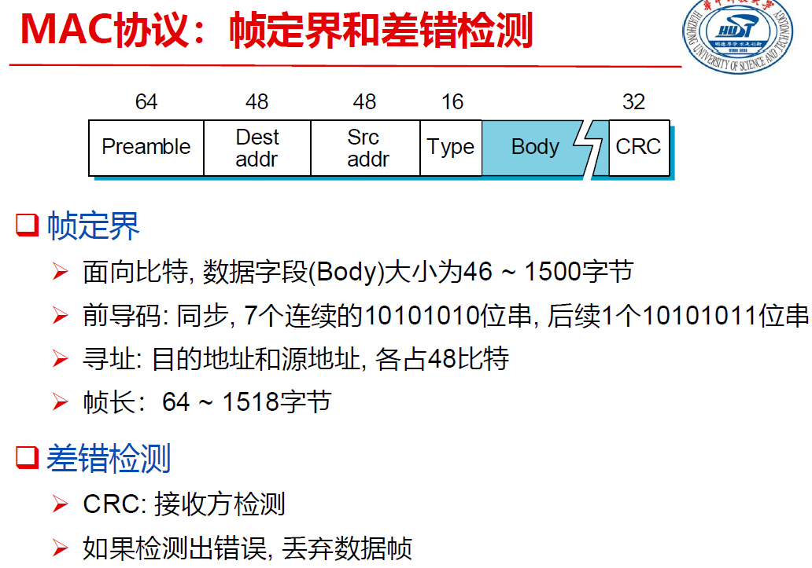

**CSMA/CD**：争用期内无冲突则无冲突，最小帧长是为了保证冲突能被检测到

**二进制退避算法**：发生第m次冲突后，从{0，……， 2^m-1}随机选择k，延时k*51.2us，k最多为1023，m＞16认为线路故障，结束退避

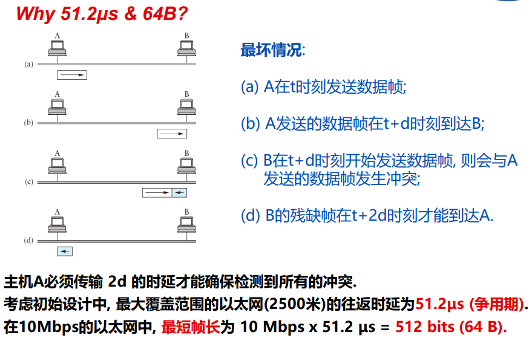

 

### 无线局域网WLAN

**CSMA/CA**（冲突避免）：基于RTS/CTS，短帧预约信道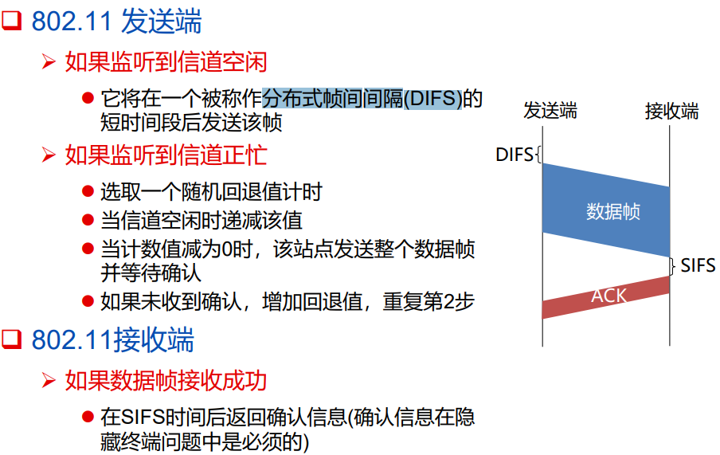

 

 

 

### IP协议

连接不同类型网络的网络层协议。无连接、不可靠的服务（尽最大努力进行数据报传送，但不对传送过程进行任何保障）

#### 分段与重组

最大传输单元MTU  ： 网络中一帧能承载的最大分组

分段重组由目的主机完成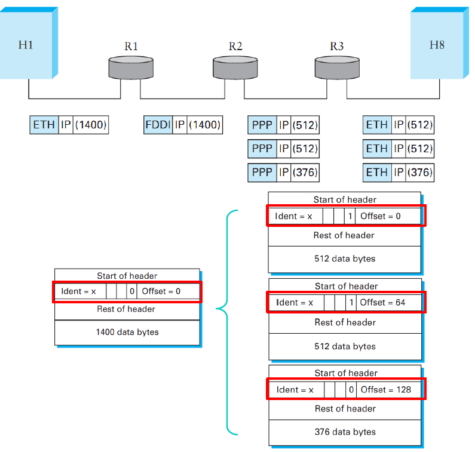

应用层的DNS（域名解析服务）完成域名与IP地址之间的映射转换

层次化地址 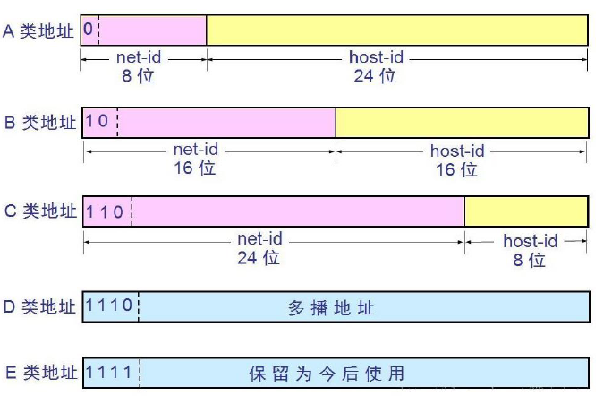

#### DHCP动态主机配置协议 

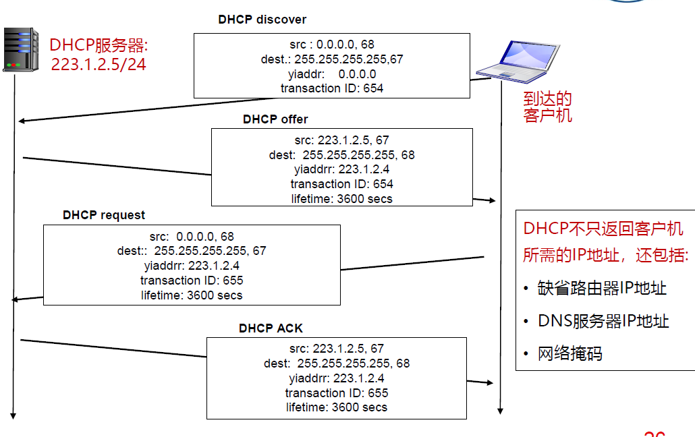

### 无分类路由选择（CIDR）

变长子网掩码、最长前缀匹配

 

分配IP地址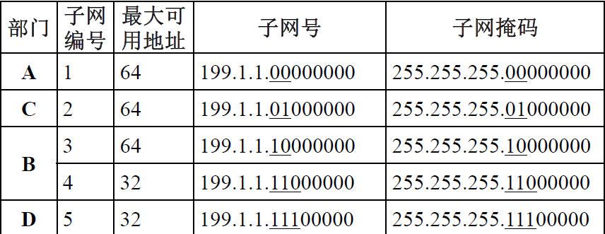

 

#### NAT网络地址转换

将多个内部地址映射为一个合法的公有地址

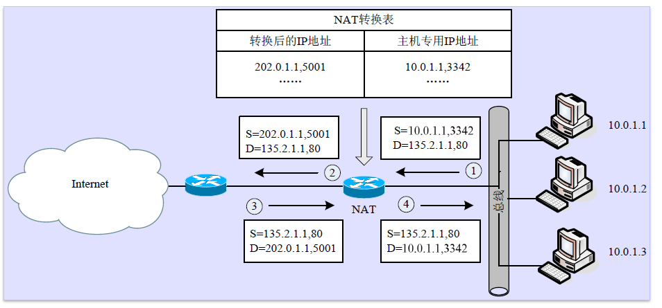

#### ICMP（Internet控制报文协议）

ICMP报文：错位原因（类型，编码）。封装于IP数据包之间

#### ARP（地址转换协议）

IP地址——>物理地址（**属于同一个物理网络内部**），ARP采用广播机制，每个主机维护一个ARP表，访问不同网络时找到本网络的一个路由器，剩下的工作由路由器完成

#### PARP

物理地址——>IP地址

 

### 距离向量路由

采用Bellman-Ford算法

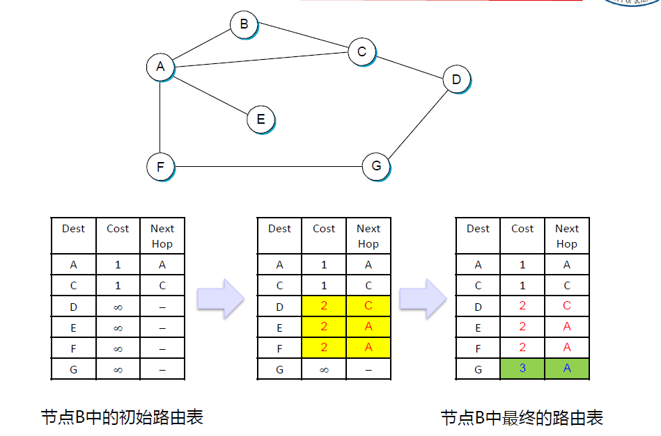

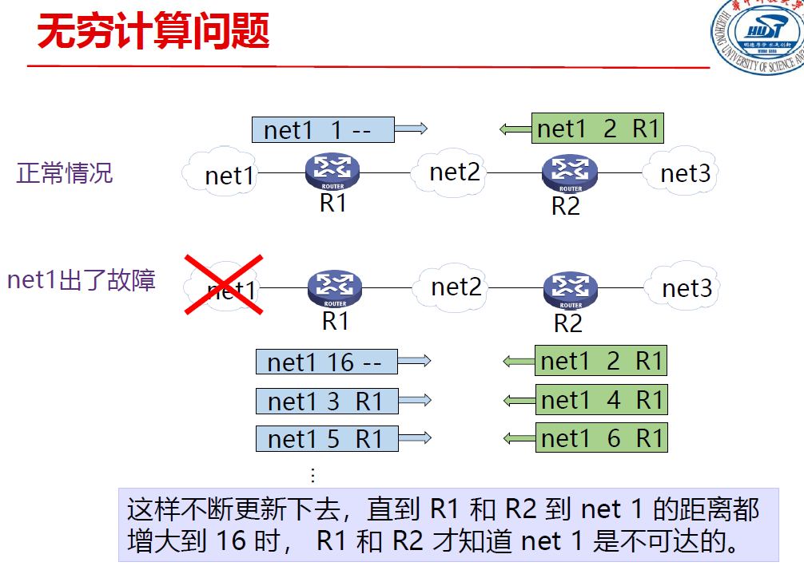

### 路由选择信息协议（RIP）

路由器通告**到达网络的代价**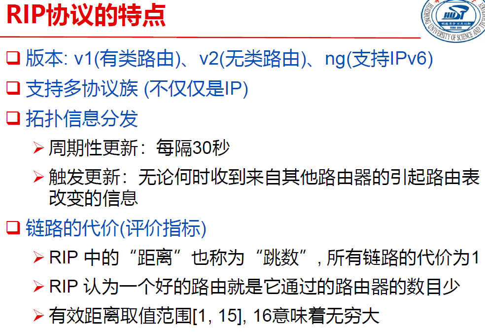

 

链路状态路由选择依赖于链路状态的可靠洪泛、**根据所有累计的链路状态知识的总和进行路由计算**

#### 路由计算

基于Dijkstra算法

试探表、证实表、（Destination，cost，next Hop）

 

链路状态分组LSP   链路状态分组LSA    一个LSP可能包含多个LSA

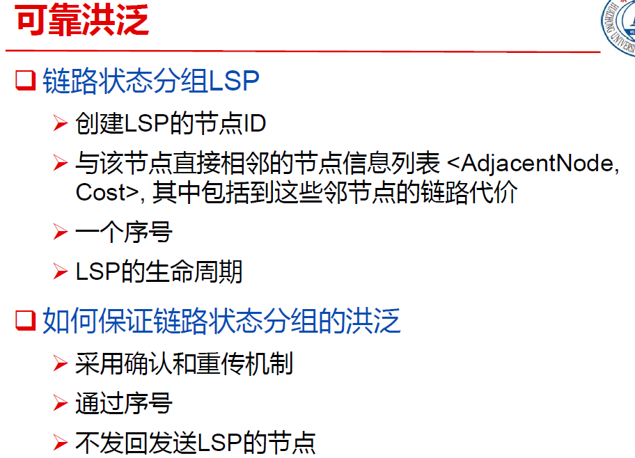

### OSPF（开放最短路径优先协议）

采用链路状态算法：LS分发（可靠洪泛）、每个节点构建网络拓扑、采用Dijkstra进行路由计算；安全机制、层次化OSPF（主干区域、非主干区域）、允许多条相同代价的路径、支持单播与多播

 

### 边界网关协议BGP

**基于策略**

自治系统（AS，也称路由选择域）内部的路由为域内路由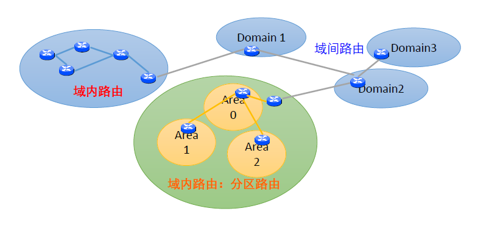

**域内路由选择**：内部网关协议IGP   (e.g. OSPF、RIP、IS-IS)  **基于评价指标**

**域间路由选择**：外部网关协议EGP（e.g. EGP、BGP（边界网关协议）） **基于策略**

 

#### 路径向量路由选择

通告**整个路径**而非单个距离（路径选择、路径通告）

**BGP Speaker**在AS的边界负责向其他AS转发路径的路由器

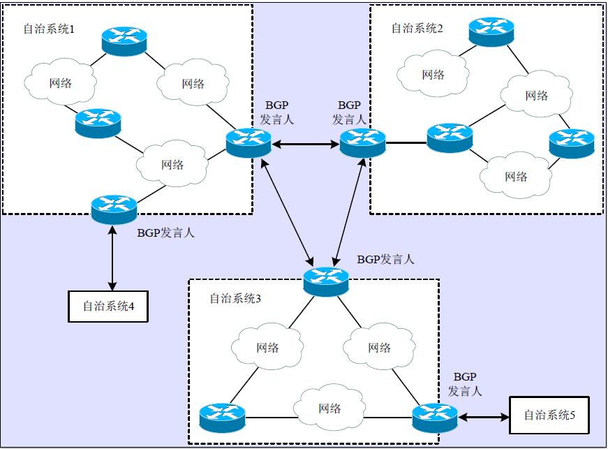

 

 

 

## 传输层

传输层提供应用进程间的逻辑通信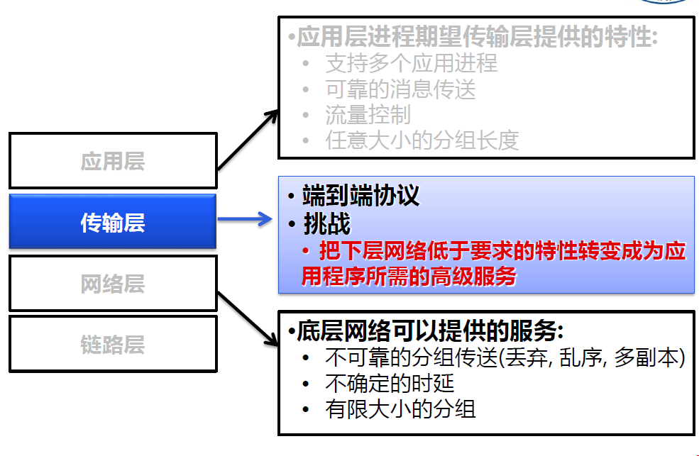

传输层的复用（不同应用进程使用同一个协议）与解复用（正确交付到目的应用进程），采用**协议端口号**，**端口就是应用进程的传输层地址**

 

### UDP

仅在IP基础上增加了一级解多路复用功能。面向报文、无连接、不可靠、无流量控制

伪首部仅为计算校验和

应用：简单查询协议（如DNS）、多媒体应用（电话、视频会议、游戏）

### TCP

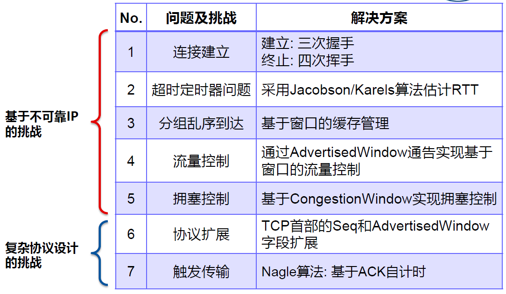

面向连接、可靠传输（保证数据传输）、流量控制、拥塞控制

最大数据段MSS，尽可能避免IP数据报分段

#### 连接建立（三次握手）

ack是期望接受消息的序号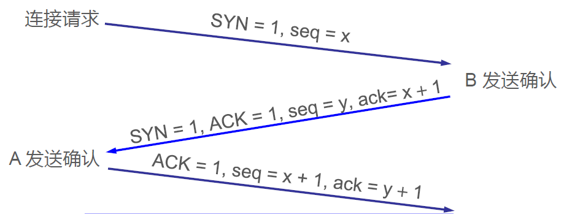

#### 连接中止（四次挥手）

双方独立关闭本方连接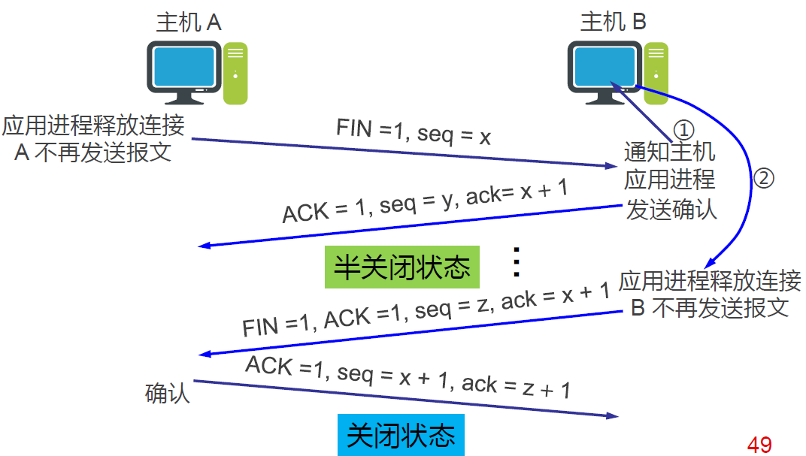

#### TCP滑动窗口算法

变化的接收窗口大小AdvertisedWindow

防止回绕：引入MSL（最大报文段生存周期）例如120s

保持管道满载：发送方窗口（AdvertisedWindow）大于时延带宽积

#### 触发传输

触发一个数据段的传输：1、收集到的数据段达到MSS 2、发送进程调用push操作使TCP发出缓存中所有未发送的字节 3、定时器激活

#### 傻瓜窗口

接收方不断发送小AdvertisedWindow，发送方不断发送小数据分组

**推迟发送**通告窗口：通告零窗口后，仅当窗口大小显著增大（达到缓存空间的一半或一个MSS）才发送新的通告窗口

**定时器设置**：发送方传输数据时机	

Nagle算法：利用ACK实现自计时

#### 自适应重传

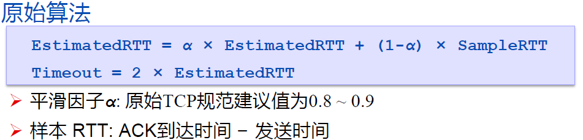

原始算法的问题：无法区分当前分组的ACK与重传分组的ACK

**Karn/Partridge算法**：改进：1、重传时停止计算样本RTT 2、每次重传设置下次超时值为上次的2倍

K/P算法的问题：没必要对较小的估计RTT乘以2；样本值变化很大时远不止是估计RTT的两倍

**Jacobson/Karels算法**：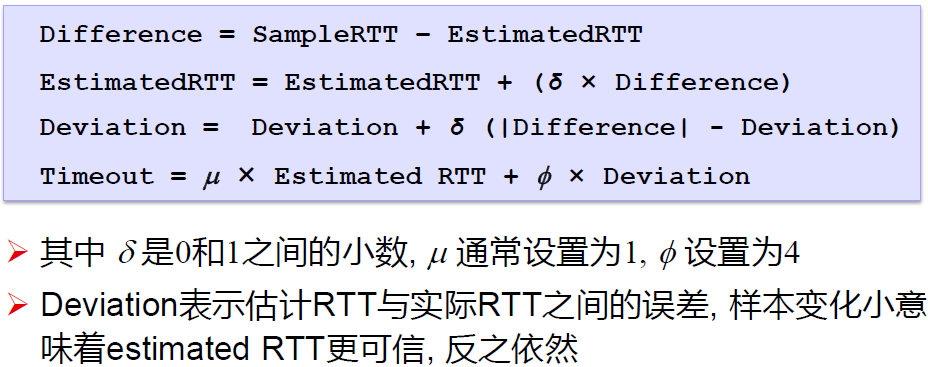

#### 拥塞控制

拥塞的体现：**持续的分组丢失**、端到端的延时不断增加（**超时**）

**察觉拥塞**：隐式反馈：以**超时**作为推断网络拥塞的标志

调整发送速率：**拥塞窗口**

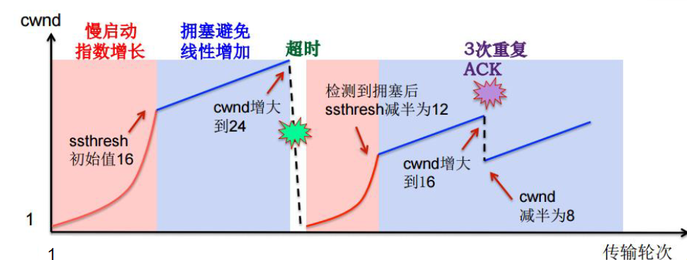
